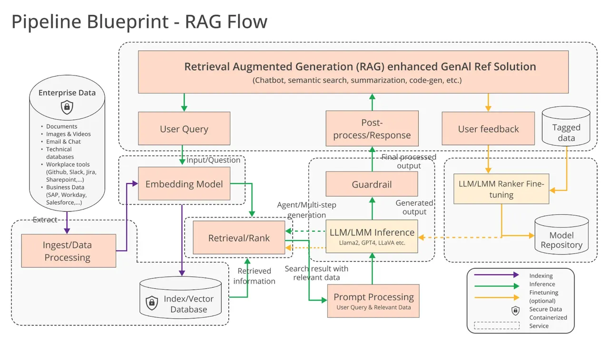

<div align="center">


# `Infinities`


<br />

[](https://x.com/infinities_pro)
[](https://www.youtube.com/@infinities-pro)
[](https://discord.gg/48mvzHk6)
[](https://infinities.pro)
[](https://docs.infinities.pro)
[](https://medium.com/@infinityonsolana/looking-ahead-the-future-of-vector-databases-c241626747b3)


[](https://opensource.org/licenses/MIT)

<p class="align center">
</p>

</div>


<div align="center">
  
</div>

<p align="center">
  <b>The AI-native database built for LLM applications, delivering lightning-fast hybrid search across dense embedding, sparse embedding, tensor (multi-vector), and full-text.</b>
</p>

<h4 align="center">
  <a href="https://docs.infinities.pro">Documentation</a> |
  <a href="https://docs.infinities.pro/benchmark">Benchmark</a> |
  <a href="https://x.com/infinities_pro">Twitter</a> |
  <a href="https://discord.gg/jEfRUwEYEV">Discord</a>
</h4>

---

Infinity is a cutting-edge AI-native database purpose-built for modern LLM applications. It supports robust hybrid search across diverse data types such as dense vectors, sparse vectors, tensors, full-text, and structured data. This makes it the perfect solution for applications like:

- **Search and Recommendations**
- **Question-Answering Systems**
- **Conversational AI**
- **Copilots**
- **Content Generation**
- **Retrieval-Augmented Generation (RAG)**

---

## 🚀 Key Features

### ⚡ Ultra-Fast Performance
- Sub-millisecond query latency: 0.1ms latency on million-scale vector datasets.
- Handles 15K+ QPS on vector queries and 12K+ QPS for full-text search on 33M documents.

> See the [Benchmark Report](https://docs.infinities.pro/benchmark) for detailed performance insights.

### 🔎 Hybrid Search
- Seamlessly combines **dense embedding**, **sparse embedding**, **tensor (multi-vector)**, and **full-text search**.
- Advanced re-ranking options, including **Reciprocal Rank Fusion (RRF)**, weighted sum, and **ColBERT**-style ranking.

### 📚 Rich Data Support
- Supports diverse data types, including strings, numerics, vectors, tensors, and more.
- Built to handle structured and semi-structured data efficiently.

### 🎯 User-Friendly API
- **Python SDK** for intuitive integration.
- A lightweight, single-binary architecture ensures easy deployment.
- Compatible with both **embedded mode** and **client-server mode**.

---

## 🛠 Getting Started

Infinity offers two modes of operation: **embedded mode** (for direct integration into Python applications) and **client-server mode** (for separate backend processes).

### ⚙ Embedded Mode

Install the embedded SDK:
```bash
pip install infinity-embedded-sdk==0.6.0.dev2
```

Use Infinity for dense vector search:
```python
import infinity_embedded

# Connect to Infinity
infinity_object = infinity_embedded.connect("/absolute/path/to/save/to")

# Retrieve a database object
db_object = infinity_object.get_database("default_db")

# Create a table with multiple column types
table_object = db_object.create_table("my_table", {
    "num": {"type": "integer"},
    "body": {"type": "varchar"},
    "vec": {"type": "vector, 4, float"}
})

# Insert data into the table
table_object.insert([
    {"num": 1, "body": "unnecessary and harmful", "vec": [1.0, 1.2, 0.8, 0.9]},
    {"num": 2, "body": "Office for Harmful Blooms", "vec": [4.0, 4.2, 4.3, 4.5]}
])

# Perform a dense vector search
res = table_object.output(["*"])\
                    .match_dense("vec", [3.0, 2.8, 2.7, 3.1], "float", "ip", 2)\
                    .to_pl()
print(res)
```

> 💡 Learn more in the [Python API Reference](https://docs.infinities.pro/pysdk_api_reference).

### 🔧 Deploy Infinity in Client-Server Mode

For larger-scale deployments, you can set up Infinity in client-server mode. See the [Deploy Infinity Server](https://docs.infinities.pro/deploy_infinity_server) guide for details.

---

## 📈 Performance Comparison

<div align="center">
  
</div>

---

## 📜 Documentation

- [Quickstart](https://docs.infinities.pro/)
- [Python API](https://docs.infinities.pro/pysdk_api_reference)
- [HTTP API](https://docs.infinities.pro/http_api_reference)
- [References](https://docs.infinities.pro/references)
- [FAQ](https://docs.infinities.pro/FAQ)

---

## 🌟 Roadmap

Curious about what’s next for Infinity? Check out the [Roadmap 2025](https://infinities.pro/roadmap) to learn more about upcoming features and improvements.

---

## 🙌 Community

Join the conversation and connect with us:

- [Website](https://infinities.pro/)
- [Twitter](https://x.com/infinities_pro)
- [Discord](https://discord.gg/jEfRUwEYEV)

---

## 🎥 Demo

> [!NOTE]
> Setting up and hosting the AutoGPT Platform yourself is a technical process. 
> If you'd rather something that just works, we recommend [joining the waitlist](https://bit.ly/3ZDijAI) for the cloud-hosted beta.

https://github.com/user-attachments/assets/8120bc03-75b5-4b5e-bb75-54d0a8439da9

This tutorial assumes you have Docker, VSCode, git and npm installed.


